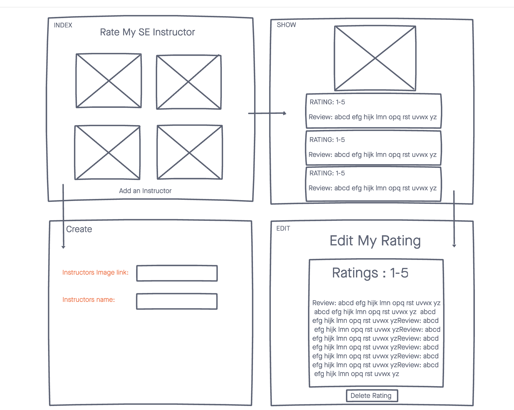

# project-2
Rate-My-Instructor

## Technologies Used:

-HTML5
-CSS3
-JavaScript
-Google Fonts
-Mongoose
-MongoDB
-EJS
-Express
-Heroku

## Wireframe:

## Next Steps:

-Add User Authentication
-Add Search Bar
-Change Star Ratings 
-Add Avg Star Rating
-Sort By Star Rating
